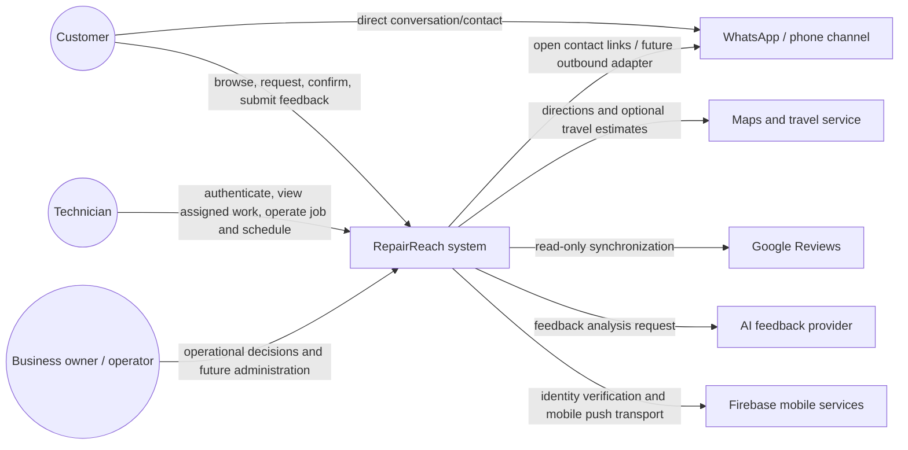

# System Context

> Classification: DECISION baseline derived from confirmed facts; unresolved external-channel details remain open decisions.

## Context diagram

## System responsibility

RepairReach coordinates service requests, customer/job history, service configuration, availability, assignments, field execution, feedback, and owner-visible operational work. It does not replace the business's direct phone/WhatsApp relationship, external review platforms, or map provider.

Customers may enter through the website or the already-existing WhatsApp Business greeting. The current architecture treats WhatsApp as an external contact/entry channel; it does not reproduce or redesign the greeting and does not make the messaging channel a second transactional booking system.

## Actors

### Customer

Can browse public information, submit a service request, receive a confirmed slot, cancel subject to the backend arrival boundary, and submit private feedback. No customer account is required by the current product direction.

### Technician

An authenticated field worker who can see only authorized assigned work, accept/reject or report inability to serve, record operational state transitions, manage allowed availability, and request/commit schedule adjustments according to permissions.

### Business owner/operator

The current business workflow intentionally includes human calls and operational schedule decisions. The owner may currently be represented by the single technician account where appropriate. A distinct owner/business-admin permission is a future authorization capability, not a requirement to build a broad admin product now.

## Authority rules

The backend is authoritative for identity mapping, service eligibility, slot availability, schedule legality, assignment, cancellation charge applicability, job transitions, feedback association, and audit history. Clients are presentation and interaction surfaces.

## Boundary rules

- Customer web and Android call versioned business APIs.
- Only Spring Boot accesses the transactional database.
- Firebase identity tokens are verified at the backend boundary and translated to application identities.
- External systems are reached through adapter ports owned by the backend; domain modules do not import provider SDKs.
- No external provider is allowed to mutate RepairReach transactional state without an authenticated, validated inbound boundary.
