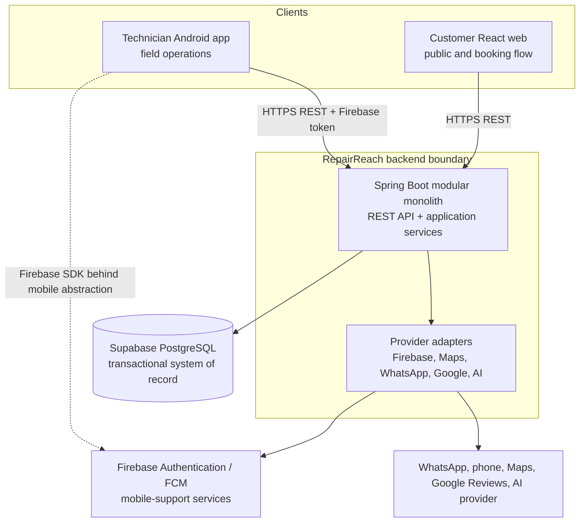

# Container Architecture

> Classification: DECISION baseline. Provider details marked optional or future are not current product requirements.

## Container diagram



## Container ownership

| Container | Owns | Must not own |
|---|---|---|
| Customer React web | Rendering, form interaction, client-side input ergonomics, routing, API response presentation | Slot truth, booking confirmation, charge rules, assignment, direct database access |
| Technician Android | Mobile navigation, cached views, authenticated API session, field interaction, retry UX | Independent scheduling rules, assignment decisions, authoritative status, direct PostgreSQL access |
| Spring Boot modular monolith | Domain rules, commands/queries, authorization, transactions, event/outbox creation, provider orchestration | UI layout, provider-specific domain semantics, Firebase database state |
| Supabase PostgreSQL | Durable relational state, constraints, indexes, transactional concurrency boundary, audit/outbox persistence | Workflow decisions hidden only in triggers, client-facing APIs |
| Firebase | Technician identity provider and mobile push support where enabled | Booking/job/schedule/customer source of truth |
| External adapters | Translation to/from provider protocols and failure handling | Core RepairReach business decisions |

## Deployment shape

The initial deployment is one Spring Boot application connected to one Supabase PostgreSQL database, with the React web deployment and Android distribution as separate clients. The modular boundaries are code-level and transaction-level boundaries, not network services. A module can later be extracted only after a real scaling or ownership pressure is demonstrated.

## Data flow

```text
Client interaction
  -> authenticated or public API request
  -> request DTO validation
  -> application command/query
  -> domain policy and repository operations
  -> PostgreSQL transaction and constraints
  -> committed result plus event/outbox records
  -> response DTO
  -> client presentation
```

Provider calls that are not required to commit core state should be driven after commit from durable outbox work. A provider failure must not roll back a valid booking or job transition merely because notification or AI analysis is unavailable.
