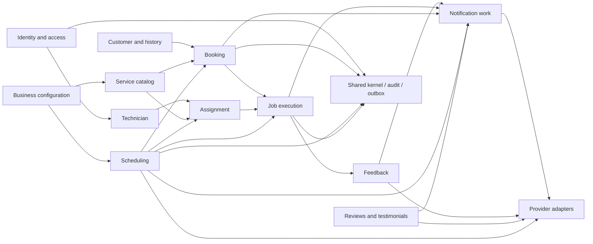

# Backend Module Boundaries

> Classification: DECISION baseline. Module ownership and forbidden dependencies are architectural contracts.

## Module map

The arrows describe application-level contracts. A lower-level module may not reach into another module's tables or ORM entities. Shared contains primitives and cross-cutting infrastructure, not business aggregates.

## Responsibilities and forbidden ownership

| Module | Owns | Commands / queries | Dependencies | Must not own |
|---|---|---|---|---|
| Identity and access | External identity mapping, application user, permissions, authentication context | Resolve identity, authorize action, revoke/disable access | Firebase adapter, technician port | Booking or technician schedule |
| Business configuration | Business profile, locations, operational settings, timezone, configurable policy values | Update business settings, read public business data | Persistence | Customer-specific workflow |
| Customer | Customer record, addresses, device/service history references, contact data | Create/find customer, manage address, query history | Business | Booking state or feedback analysis |
| Service catalog | Service offerings, supported locations, duration/planning constraints, capability requirements | Publish/retire service, get eligible offerings | Business | Technician availability |
| Booking | Customer service request and booking lifecycle | Create request, confirm slot, cancel, expose public summary | Customer, catalog, scheduling | Detailed field execution or provider calls |
| Scheduling | Availability, slot calculation, reservations, schedule revisions, conflict resolution | Calculate slots, reserve/release/move schedule, record actual times, reflow | Business, technician/capability ports, catalog constraints, optional maps port | Customer-facing notification delivery |
| Technician | Technician profile, capability, employment/active state, allowed availability input | Manage profile/capability/availability intent | Identity, business | Choosing another technician's booking without assignment policy |
| Assignment | Assignment record and selection/reassignment policy | Select, assign, accept/reject, reassign | Technician, catalog, scheduling | Directly editing schedule tables |
| Job | One service lifecycle from visit through optional workshop handling | En-route, arrive, start/diagnose, transfer, workshop, complete, unable-to-serve | Booking, assignment, scheduling, customer | AI interpretation or external review |
| Feedback | Immutable customer feedback and analysis request reference | Submit, read, request analysis | Job, AI port through application boundary | Rewriting original feedback or auto-response |
| Reviews/testimonials | Curated website testimonials and imported external review snapshots | Publish/unpublish testimonial, sync/read reviews | Google adapter | Posting or editing external reviews |
| Notification work | Durable notification intents/outbox, delivery attempts, preferences when defined | Enqueue, retry, mark delivered/failed | All producing modules, provider adapters | Deciding whether a schedule change is valid |
| Provider adapters | Protocol translation, credentials boundary, provider errors | Send/read provider operations | SDKs/HTTP clients | Domain entity decisions |

## Public interfaces between modules

Modules expose application interfaces such as `SlotAvailability`, `ScheduleReservation`, `TechnicianCandidateQuery`, `BookingReference`, and `JobReference`. Interfaces exchange IDs and immutable DTO/value objects rather than JPA entities.

The application layer may orchestrate a multi-module use case. For example, booking confirmation coordinates customer lookup, catalog validation, assignment candidate selection, and schedule reservation in one transaction while each module retains ownership of its state.

## Dependency rules

- Controllers depend on application services, never repositories directly.
- Domain code depends on ports, not Firebase/Maps/AI SDKs.
- Scheduling is a reusable domain service called by booking, assignment, and operator commands; it is not embedded in controllers or screens.
- Job owns operational transitions; scheduling owns time reservations. Neither updates the other's tables directly.
- Cross-module reads use query ports or read models; no module queries another module's private repository.
- Events/outbox records are integration seams, not a substitute for transactional domain invariants.
