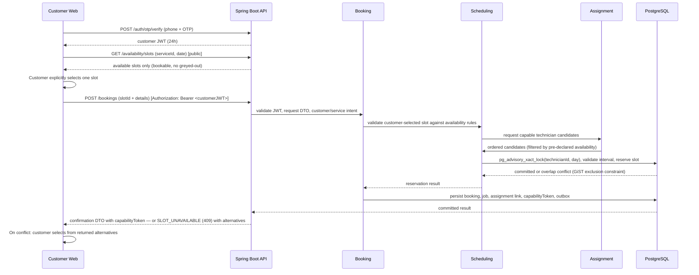
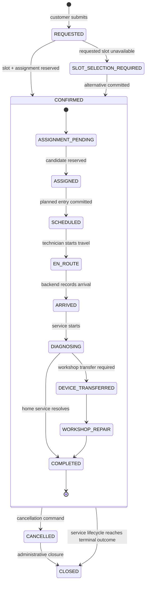

# Booking Architecture

> Classification: DECISION confirmed.

## Booking versus job versus schedule

These are intentionally separate concepts:

```text
Customer request
    -> Booking (what was requested and committed)
    -> Assignment (who is responsible)
    -> Schedule entry (when and where the work is reserved)
    -> Job (how the service is executed and completed)
```

Reasons:

- A booking can exist before assignment or while an alternative slot is being resolved.
- A job can continue through workshop repair after the home-visit schedule entry ends.
- A schedule entry can move while preserving the booking reference and job history.
- A future job may need multiple activities/schedule entries without duplicating customer service history.

## Customer authentication prerequisite

Customer authentication (phone OTP) is **required before booking creation**. The customer must hold a valid customer JWT before calling `POST /api/bookings`. Public endpoints (`GET /api/availability/slots`, `GET /api/services`) remain unauthenticated. See `10-authentication-architecture.md` for the full auth flow.

## Customer slot selection

The customer explicitly selects a timeslot from the list returned by `GET /api/availability/slots`. The response contains **only genuinely bookable slots** — unavailable, booked, blocked, and break intervals are excluded entirely. The customer sees only what they can actually book.

The booking request carries the customer-chosen `slotId`, `slotStartTime`, and `slotEndTime`. The backend **never auto-assigns the nearest or best available slot**. If the `slotId` is missing, the request is rejected with HTTP 400.

If the selected slot has been taken by another customer between display and submission (a race), the backend returns `SLOT_UNAVAILABLE` (HTTP 409) with a list of current alternative available slots. The customer re-selects from alternatives — the backend never silently falls back.

## Booking command flow



The application service owns the transaction boundary. External notification is not required to commit a booking. The booking transaction re-validates the chosen slot under a lock because availability data shown to the customer can become stale between the GET and POST.

## Booking states

The booking state is intentionally narrower than the job state:

| State | Meaning |
|---|---|
| `REQUESTED` | Customer request accepted for validation/slot resolution; not yet a committed appointment |
| `SLOT_SELECTION_REQUIRED` | The requested slot could not be committed; alternatives or operator resolution are required |
| `CONFIRMED` | A schedule reservation and associated job have committed |
| `CANCELLED` | Customer/business cancellation committed; arrival-based charge applicability is recorded on the job/cancellation outcome |
| `CLOSED` | Administrative closure after the service lifecycle is complete or unable to serve |

`ASSIGNED`, `SCHEDULED`, `ARRIVED`, and `COMPLETED` are job/schedule concepts, not duplicated booking states.

## Booking and job lifecycle diagram



The nested execution states are job states. A booking remains `CONFIRMED` while a job moves through execution and can be closed after the terminal outcome. A service that does not need travel, transfer, or workshop repair skips those states through explicit legal transitions; it does not invent fake steps.

## Transition contract

| Current | Action / actor | Preconditions | Next | Side effects / invalid cases |
|---|---|---|---|---|
| none | Submit booking / customer web | Valid customer JWT; valid service, location, contact, problem, and **explicitly customer-selected** slotId | `REQUESTED` | Idempotency record; invalid DTO (including missing slotId or invalid JWT) is rejected; backend never auto-selects a slot |
| `REQUESTED` | Reserve slot / backend | Customer-selected slot passes availability and conflict validation | `CONFIRMED` | Booking transitions directly to CONFIRMED when slot is within technician's pre-declared availability; job + assignment created atomically; capabilityToken issued |
| `REQUESTED` | Slot conflict / backend | Customer-selected slot is concurrently taken | `SLOT_SELECTION_REQUIRED` | HTTP 409 with typed `SLOT_UNAVAILABLE` code and alternatives list; customer must re-select; never fake confirmation |
| `SLOT_SELECTION_REQUIRED` | Customer re-selects from alternatives | Customer explicitly picks an alternative available slot | `CONFIRMED` | New reservation committed atomically under the same pg_advisory_xact_lock + GiST protection |
| `CONFIRMED` | Cancel / customer before arrival | Capability JWT valid; cancellation policy permits | `CANCELLED` | Job cancellation record includes `PRE_ARRIVAL_NO_VISIT_CHARGE` |
| `CONFIRMED` | Cancel / customer after arrival | Job has recorded arrival; capability JWT valid | `CANCELLED` | Outcome includes `POST_ARRIVAL_VISIT_CHARGE_APPLICABLE` |
| `CONFIRMED` | Complete lifecycle / backend | Job reaches terminal service outcome (`COMPLETED`) | `CLOSED` | **Auto-trigger**: backend generates `feedbackCapabilityToken`, writes outbox record → notification adapter delivers WhatsApp feedback link to customer. Customer does not need to find the feedback form. |
| `CANCELLED` | Administrative close | Cancellation and audit record exist | `CLOSED` | No reopening through public customer API |

## Customer cancellation authority

The customer may cancel but may not reschedule a confirmed booking. Rescheduling and schedule adjustment are technician/operator commands. A public cancellation command is authorized by an unguessable booking capability or equivalent proof and is revalidated inside the transaction.

The arrival boundary is established only by the backend `record arrival` command. A client checkbox, phone call, or displayed status cannot establish arrival. The command records actor, timestamp, job version, location/context where available, and audit event. Cancellation reads that committed `arrived_at` value under the same transaction.

The pre-visit customer call remains an intentional human operational activity. The system may expose the customer's contact action and record a call-related job event if later required, but it does not assume that a call must be automated or that a call alone confirms arrival.

## Idempotency and stale requests

Booking creation accepts an idempotency key scoped to the public client/session and stores the resulting booking response. A repeated request returns the same result. If a selected slot is taken after it was displayed, the API returns a typed conflict with current alternative slots; it does not downgrade the request to an unconfirmed booking silently.
