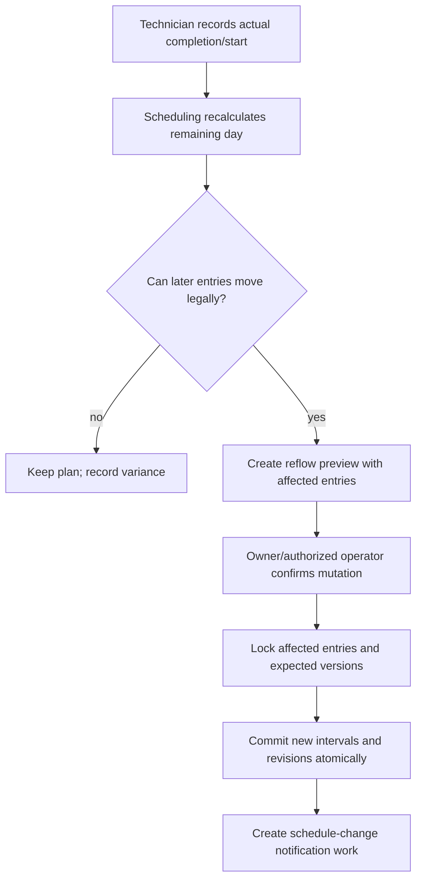

# Scheduling Architecture

> Classification: DECISION baseline. Exact hours, slot values, travel, and emergency policy are open decisions, not invented facts.

## Scheduling is a domain service

Scheduling owns availability interpretation, slot calculation, reservations, overlap prevention, mutations, and schedule history. It is called through an application/domain API; it is not implemented in React, Android, a controller, or a database trigger.

## Domain API

The implementation should provide a stable interface equivalent to:

```text
calculateAvailableSlots(serviceId, location, date, timeZone)
  → returns ONLY genuinely bookable slots for the requested day.
    Taken, blocked, break, outside-hours, and technician-unavailable
    intervals are excluded entirely — they are never shown to the customer.
    The customer sees only what they can actually book.

reserveSlot(bookingId, jobId, customerSelectedCandidate, assignmentContext)
  → validates the customer-chosen slot under a conflict lock; commits the reservation
    or returns SLOT_UNAVAILABLE with current alternative available slots.

releaseReservation(scheduleEntryId, reason)
moveScheduleEntry(entryId, proposedInterval, reason, actor)
previewReflow(resource/day, trigger, policy)
commitReflow(previewId, expectedVersions, actor)
recordActualStart(jobId, timestamp, actor)
recordActualCompletion(jobId, timestamp, actor)
```

These are business operations, not CRUD methods. Every mutation returns the committed schedule revision and affected entries.

## Inputs

- Business timezone and configured working hours.
- Recurring weekly availability rules.
- Date-specific exceptions and full-day blocks.
- Technician availability and capabilities.
- Service planning duration and location support.
- Fixed slot grid/configuration where the business uses slots.
- Breaks and unavailable intervals.
- Existing active schedule entries.
- Travel buffer/estimate when the business enables it.
- Emergency/urgent policy and operator authorization.

The exact weekday hours, slot granularity, travel calculation, and emergency policy remain configuration/open decisions where not confirmed.

Known current operating inputs are preserved as configuration requirements: Sunday is shorter and ends around the afternoon, an afternoon break is around 2 PM–4 PM, and regular availability follows a predictable weekly pattern. Exact opening/closing values remain unconfirmed and must not be invented.

## Scheduling authority

| Question | Authority |
|---|---|
| Who calculates available slots? | Scheduling module, using catalog, availability, technician, travel, and existing reservation inputs |
| Who reserves a slot? | Booking/assignment application service through the scheduling reservation command inside a PostgreSQL transaction |
| Who changes a confirmed slot? | Authorized technician/operator command; the customer cannot reschedule a confirmed booking |
| Who resolves a conflict? | Database constraint and scheduling transaction for races; assignment/operator workflow when no candidate remains |
| Who updates affected work? | Scheduling commits all affected schedule entries/revisions; booking/job read views then expose current timing, and outbox work records communication needs |
| Who records why it changed? | Scheduling audit/revision records with actor, reason, expected versions, and affected entries |

## Availability precedence

Recommended precedence is:

```text
explicit date exception
  > technician-specific exception
  > recurring technician rule
  > business recurring rule
  > default unavailable
```

An interval is bookable only when the effective availability is open, the service is supported at the location, the technician is capable, the planning duration plus required buffers fits, and no active reservation overlaps.

## Slot calculation and reservation

Slot calculation is **read-only and for customer display**. `calculateAvailableSlots` returns **only genuinely bookable slots** — slots that are within configured working hours, within the technician's pre-declared availability, have no active reservation overlapping the service duration, and are not blocked by breaks or exceptions. Taken, blocked, or outside-hours intervals are excluded entirely from the response. The customer never sees what they cannot book.

The backend does **not** auto-assign the nearest or best available slot. If the customer submits a booking without a `slotId`, the request is rejected with HTTP 400. The customer explicitly picks one slot from the returned list.

Reservation is authoritative. The booking transaction **re-validates** the customer-chosen slot under a `pg_advisory_xact_lock` keyed on technician + day before inserting the schedule entry. The GiST exclusion constraint on `schedule_entry(technician_id, active_interval)` is the final hard stop against any race that slips through. If the slot is taken by a concurrent booking, the backend returns `SLOT_UNAVAILABLE` (HTTP 409) with a typed list of current alternative available slots. The customer then selects one of those alternatives — the backend never silently falls back.

For multiple technicians, the scheduler evaluates each candidate in deterministic order inside the same transaction; the first candidate with a free interval for the customer-chosen time wins. A 409 is only returned when all candidates are exhausted.

## Slot conflict protection

PostgreSQL is the final authority for overlap. The `schedule_entry` table uses a `TSTZRANGE` column (`active_interval`) and a GiST exclusion constraint that prevents two ACTIVE entries with the same `technician_id` from having overlapping intervals:

```sql
CONSTRAINT schedule_entry_no_overlap EXCLUDE USING gist (
    technician_id WITH =,
    active_interval WITH &&
) WHERE (status = 'ACTIVE')
```

The application transaction additionally:

1. locks a canonical technician/day conflict key (or equivalent advisory transaction lock);
2. locks affected active schedule rows for a mutation;
3. re-reads availability, capability, and expected versions;
4. inserts/updates the schedule entry and revision;
5. relies on the exclusion constraint as the last race-proof check;
6. commits booking/job/assignment changes and outbox records together.

If another request wins the race for the same slot, the loser receives `SLOT_UNAVAILABLE` (HTTP 409) and a list of current alternatives. It is impossible for two customers to both receive a confirmed reservation for the same exclusive slot. The race winner is determined by the database transaction commit order, not by client timing.

## Early completion and delay

Actual execution timestamps are separate from planned schedule timestamps. Recording early completion does not silently alter later customer appointments.



The same flow applies to delay. A reflow preview must show affected bookings, old/new intervals, conflicts, and any entries that cannot move. A committed mutation updates all affected schedule entries in one transaction or commits none.

## Emergency work

Emergency work is a booking priority/operational reason, not permission to violate overlap or silently displace confirmed customers. The initial policy can allow an operator-authorized insertion only when a feasible interval exists or after a reflow transaction creates an explicit affected-booking plan. Customer communication remains a separate post-commit notification concern.

## Schedule history and audit

Current schedule entry is mutable because operations change. Every mutation appends an immutable schedule revision with actor, reason, command/idempotency key, previous and new interval, affected entries, and timestamps. Audit history supports customer-service explanation and dispute handling.

## Notifications boundary

Scheduling emits a committed `ScheduleChanged` event/outbox record. It does not select WhatsApp/SMS/email/push in the domain. Notification policy and provider delivery consume the durable record after commit.
