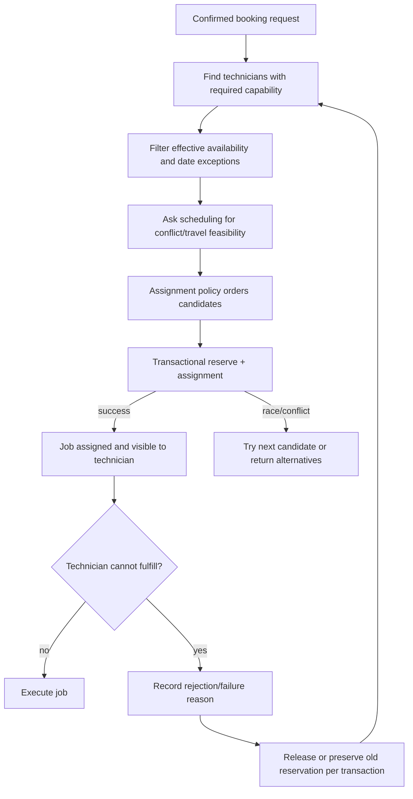

# Technician Assignment Architecture

> Classification: DECISION baseline. The initial policy is intentionally extensible, not a claim that a final optimization algorithm exists.

## Assignment flow



## Policy boundary

Assignment exposes a policy interface rather than hardcoding `first available`:

```text
AssignmentPolicy.selectCandidate(eligibleTechnicians, jobRequirement, scheduleContext)
```

The initial policy can be a deterministic filter-and-score policy:

1. active technician;
2. required service capability;
3. service location supported;
4. no schedule conflict after duration/travel checks;
5. operator constraints;
6. stable tie-breaker for equal candidates.

The score must be explainable and stored with the assignment decision. It should not be presented as an optimization engine. Future policies may add workload balancing, geography, priority, or skill level without changing booking or job contracts.

## One-technician behavior

The current deployment has one technician record. That record passes through the same candidate filter and reservation path. There is no special `father` branch and no singleton foreign key hidden in booking.

## Assignment data

An assignment records job, technician, effective interval/context, status, selection reason/policy version, actor, created time, accepted/rejected time, and supersession/reassignment relation. Historical assignments remain queryable.

## Technician rejection/failure

The technician app may present `Reject`, but backend semantics are `cannot_fulfill_assignment`. The command requires a reason category and optional note, verifies the actor owns the current assignment, and records the event. It then invokes a reassignment workflow:

- preserve the old assignment history;
- do not expose the job as unassigned without a durable next action;
- release the old reservation only when safe;
- select another capable candidate and reserve their interval atomically;
- if no feasible candidate exists, put the booking/job into an owner-resolution state and create notification work.

## Owner override

An owner/operator override is a separate command from policy selection. It still validates capability, availability, conflict, and audit requirements. Authorization may initially be limited to the technician account acting as owner; a distinct owner permission is future.

## Travel

Travel is a scheduling input, not merely a UI label. The assignment boundary consumes a `TravelEstimate` port when configured. If no trusted provider/route is available, the system must use an explicitly configured fixed buffer or mark travel unmodeled; it must not claim precise travel correctness from a map link alone.
