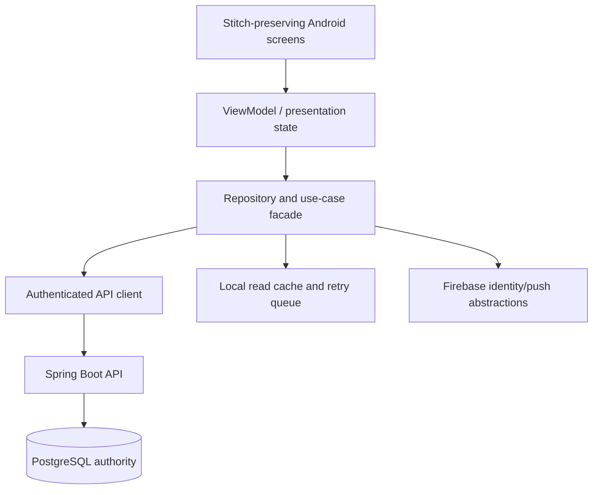

# Technician Android Architecture

> Classification: DECISION baseline preserving the inspected Android design input; offline behavior is an MVP recommendation, not a full offline requirement.

## Layered client

The implementation may choose Android framework libraries later. The architectural rule is that screens call presentation/use-case interfaces, not Spring internals or database clients.

## Screen-to-capability mapping

| Design surface | Backend data/actions |
|---|---|
| Today's Jobs | Assigned job query for date, contact links, legal job actions, exceptional unable-to-serve report |
| Job Details | Job query, travel/directions link, en-route/arrive/start/transfer/complete commands |
| Schedule | Technician-scoped schedule query, schedule adjustment preview/commit where authorized |
| Availability | Effective system-managed availability, working-time, breaks, and assignment-capacity query |
| Profile | Application user/technician profile, summary queries, logout/session and support links |

The visual `Messages`, `Parts`, or arbitrary add-job affordances are not current domain requirements unless promoted through an approved decision.

## Backend authority

Android may disable obviously invalid actions based on returned state, but it must not decide whether a slot is available, a transition is legal, a technician is capable, or a cancellation incurs a visit charge. Server responses replace stale local state.

## Temporary network loss

MVP recommendation:

- cache the last assigned jobs/schedule for read-only continuity;
- display freshness and offline status;
- allow retryable mutations to enter a small local pending-command queue with idempotency keys;
- do not mark arrival/completion as committed until the backend acknowledges it;
- on reconnect, replay only commands whose semantics are safe and show conflicts for stale versions;
- do not implement offline schedule calculation, offline assignment, or full offline-first synchronization.

## Firebase usage

Firebase SDK access is behind `MobileIdentityGateway` and `PushRegistrationGateway`. The repository does not read/write Firestore and does not derive job truth from Firebase. Push notification receipt is a hint to refresh from the API, not a state update by itself.

## Design preservation

The Android implementation must preserve the supplied field-first visual language: Inter typography, blue primary, high-contrast status, 48px minimum touch targets, rounded cards, persistent bottom navigation, and sticky job action area. Visual preservation cannot weaken server authorization or state handling.
