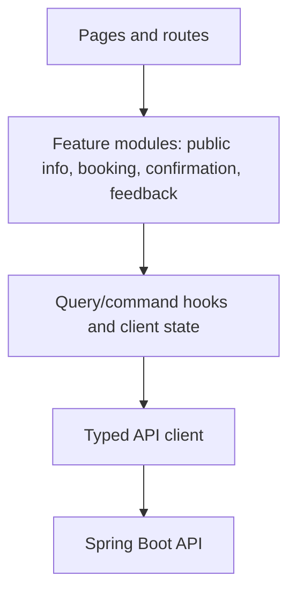

# Customer Web Architecture

> Classification: DECISION baseline preserving the inspected customer design input; missing public pages are not inferred as supplied screens.

## Layered React client

The customer web application owns presentation and interaction. It does not import database schemas, Supabase client credentials, JPA models, or scheduling algorithms.

## Booking flow

1. Load public business and published service catalog.
2. Collect only confirmed/approved booking fields: customer contact, service, location, problem description, date/time intent.
3. Request backend-calculated slots using service/location/date context.
4. Submit the selected slot with an idempotency key.
5. Render the backend's committed confirmation or typed alternative/conflict response.
6. Permit public cancellation only through the backend capability; do not offer customer rescheduling.
7. Submit job-scoped private feedback after service through a scoped capability.

Client-side validation improves usability but never replaces server validation. Optimistic UI is limited to presentation states; booking confirmation and schedule mutation require a committed API result.

## Design preservation

The implementation should preserve the inspected customer package's Manrope typography, teal trust palette, light surfaces, rounded cards, visible labels, 48px touch targets, 8px spacing rhythm, and responsive mobile-first layout. The package contains only booking/confirmation/feedback screens; public business/services/contact/reviews pages remain a product-surface implementation task and should not be invented here.

Three.js may be used for appropriate web visual enhancement, but it has no role in booking, scheduling, data access, or domain decisions.

## Anonymous customer data

The browser may hold a short-lived public flow token/reference for confirmation or feedback. It must not store privileged API credentials or customer history beyond what is needed for the current flow. Browser state is not authoritative after reload; it refetches through a scoped API capability.

## Failure UX contract

The web client must distinguish validation errors, expired capability, slot conflict with alternatives, rate limiting, and server outage. A timeout after booking submission triggers idempotent status lookup rather than a second unkeyed booking attempt.
