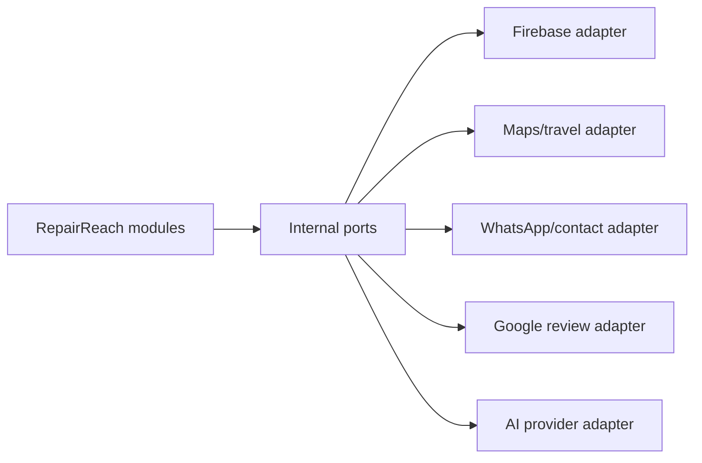

# External Integration Architecture

> Classification: DECISION baseline. Provider names identify boundaries; exact providers/channels remain open where listed.

## Adapter boundary

The domain depends on internal contracts such as `TravelEstimator`, `ReviewSource`, `MobileIdentityVerifier`, `NotificationSender`, and `FeedbackAnalyzer`. Provider SDKs, HTTP payloads, retries, and credentials stay in adapters.

## Responsibilities and failure modes

| Adapter | Direction | Responsibility | Failure behavior / credentials |
|---|---|---|---|
| Firebase identity | Android -> backend verification | Verify technician identity token and map external subject | Reject invalid/expired tokens; provider configuration is server/mobile secret material. Degrades to rejecting technician logins if unconfigured. |
| Firebase push | Backend -> Android | Deliver notification hints after durable outbox commit | Retry with backoff; mark delivery failure without changing booking/job truth. Skips silently if credentials missing. |
| Maps/travel | Backend or client deep link | Directions and optionally estimate travel for scheduling; client may open map app | Use configured fixed buffer or return unavailable if estimate fails/unconfigured; API key/secrets protected, no false precision. |
| WhatsApp/phone | Customer/technician -> external channel; future backend -> provider | Launch direct contact now; future outbound messaging only through explicit policy | Link/deep-link failures do not invalidate booking. Backend delivery adapter skips silently if credentials missing. |
| Google reviews | Google -> backend synchronization | Read external review snapshots for display/curation | Retry and preserve last successful sync; never write reviews. Returns `{"configured": false}` empty state if unconfigured. |
| AI provider | Feedback -> provider, analysis -> backend | Analyze immutable feedback into a strict internal result | Async retry; failed analysis is visible as failed/pending. Skips silently if unconfigured. |

## Graceful degradation and local testability

Every external adapter (Google Reviews, AI provider, WhatsApp/notification, Firebase) must check for its required credentials at startup (e.g. from `.env`) and **degrade gracefully** if they are missing. The application must start successfully and the core booking flow must operate even if all external adapters are unconfigured.

- **Reviews**: Unconfigured state returns `configured: false` with an empty review list; frontend displays a placeholder or hides the section.
- **AI Analysis**: Unconfigured state simply skips the analysis step; feedback remains in `PENDING` or `UNANALYZED` state.
- **Notifications**: Unconfigured state logs the message to the console instead of throwing an error or crashing the outbox processor.

This ensures the system is testable locally by simply cloning the repository and running it without mandatory cloud dependencies.

## Outbound work

Notifications, AI analysis, and review synchronization are durable post-commit work. The transaction writes an outbox item containing event type, aggregate reference, payload version, and idempotency key. A worker/trigger mechanism can process it inside the modular monolith without Kafka/RabbitMQ.

## Inbound synchronization

External review synchronization is pull/read-only unless a later provider contract explicitly supports a validated webhook. Imported content carries source, external ID, fetched time, and content hash. Local curation determines whether a review is shown.

## Provider replacement

Provider-specific IDs and payloads live in adapter records or integration metadata. Domain records store normalized internal values. Replacing a maps or AI provider should not change booking, schedule, feedback, or job aggregates.
