# Feedback and AI Architecture

> Classification: DECISION baseline. AI output is advisory and provider-neutral; automatic customer response is explicitly excluded.

## Flow

```mermaid
flowchart LR
    C[Customer submits rating/comment] --> F[Feedback module]
    F -->|immutable feedback + outbox| Q[Analysis work]
    Q --> AD[Feedback Analysis interface]
    AD --> P[AI provider adapter]
    P --> R[Validated analysis result]
    R --> S[Severity/unhappy signal policy]
    S --> E[Owner escalation work item]
    E --> O[Human owner follow-up]
```



## Separation of records

### Original feedback

Customer-authored rating/comment, submission timestamp, job reference, capability/audit context, and any consent relevant to the flow. Once accepted, it is immutable. A correction path, if ever needed, creates a new auditable record; it does not overwrite source text.

### AI analysis

Versioned result linked to feedback: provider/model identifier, prompt/schema version, status, sentiment, concern categories, severity, unhappy-customer signal, confidence/uncertainty if provided, created time, and failure reason. It is advisory and may be re-run with a new analysis version.

### Business follow-up

Owner-visible escalation state, reason, priority, notes, assigned human, contact outcome, and resolved time. This is a human workflow and must not be inferred as an automatic customer response.

Private feedback and the customer's choice to visit an external public-review platform remain independent. A negative private rating must not suppress a public-review option, and RepairReach must not author or submit that public review.

## Interface contract

```text
FeedbackAnalysisResult analyze(ImmutableFeedback input, AnalysisContext context)
```

The adapter must return a schema-validated result or a typed failure. The domain does not accept arbitrary provider JSON as business state.

## Asynchronous design

Analysis is asynchronous-capable even if an MVP implementation executes it immediately after submission. The feedback transaction commits first, then creates analysis work. This prevents provider latency/outage from blocking customer feedback persistence and makes retry, provider replacement, and audit possible.

## Failure and safety

- Store `PENDING`, `RUNNING`, `COMPLETED`, and `FAILED` analysis status.
- Retry transient provider failures with bounded backoff and idempotency.
- Preserve the feedback when analysis fails.
- Do not send customer messages automatically.
- Do not let AI change rating/comment or directly close an escalation.
- Restrict feedback text and analysis visibility to authorized business users.
