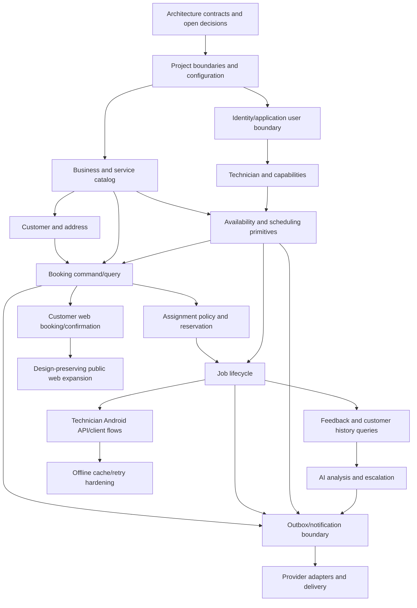

# Implementation Dependency Graph

> Classification: FUTURE implementation roadmap. It defines dependency order and acceptance intent, not production code.

This is a planning dependency graph, not an implementation instruction to generate code during the architecture phase.

## Phases

### Phase 0 — Contract and decision closure

Prerequisites: this architecture set. Resolve exact hours, slot model, public capability/token policy, Firebase service selection, notifications, Maps/travel, and AI provider decisions. Acceptance: no implementation team needs to infer the booking/schedule invariants.

### Phase 1 — Foundations

Implement the modular monolith skeleton, PostgreSQL connectivity/migrations, identity mapping, business configuration, shared error/audit/idempotency primitives, and deployment configuration. Acceptance: authenticated technician identity maps to an application technician without exposing provider IDs to the domain.

### Phase 2 — Catalog, customer, availability

Implement service offerings/capabilities, customer/address data, recurring availability, exceptions, and read APIs. Acceptance: unsupported service/location and unavailable periods are rejected by backend rules.

### Phase 3 — Booking, reservation, assignment

Implement slot calculation, atomic reservation, overlap constraint, one-technician assignment policy, booking confirmation/alternative response, and cancellation boundary. Acceptance: concurrent booking tests cannot confirm overlapping exclusive work.

### Phase 4 — Job execution and Android workflows

Implement job state transitions, technician queries/mutations, arrival, actual timing, transfer, completion, and authorization. Translate supplied Android screens without moving domain rules into the client. Acceptance: technician sees only assigned work and all illegal transitions are rejected.

### Phase 5 — Schedule adjustment

Implement previews, expected-version checks, early/delay reflow, reassignment, revisions, and audit. Acceptance: a multi-entry adjustment commits all affected changes atomically or none; notifications are queued after commit.

### Phase 6 — Customer feedback/history/reviews

Implement feedback capability, immutable feedback, history projections, curated testimonials, and read-only review sync boundary. Acceptance: negative feedback remains stored and public-review facilitation is independent.

### Phase 7 — AI and notification delivery

Implement outbox processing, provider adapters, async analysis, escalation, and selected notification channels. Acceptance: provider failure preserves core state and creates observable retry/failure work.

### Phase 8 — Hardening

Add rate limiting, privacy review, observability dashboards/alerts, mobile cache/retry behavior, accessibility validation, and end-to-end concurrency/contract tests. Acceptance: production-readiness checks pass without introducing distributed infrastructure prematurely.

## Test dependency emphasis

Scheduling and booking tests precede client tests. Contract tests should cover public slot/booking conflicts, technician authorization, idempotent retries, state transitions, reflow atomicity, outbox behavior, immutable feedback, provider failures, and one-to-many technician assignment.
