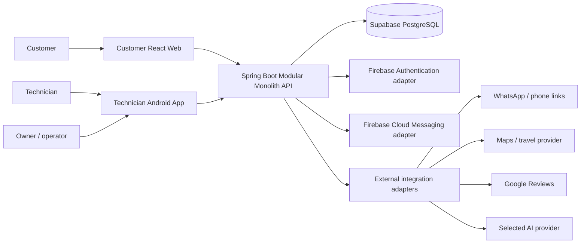

# RepairReach Architecture

Status: Architecture design baseline for implementation planning. No application code is defined or implemented by this document set.

## Purpose

This document set is the implementation-authoritative architecture for RepairReach's first release and its deliberate path from one technician to a multi-technician electronics service company.

The governing principle is:

```text
Domain semantics
  -> ownership boundaries
  -> data flow
  -> transactional commands
  -> stable interfaces
  -> frontend implementation later
```

The customer web application and technician Android application are separate first-class clients. Neither client talks directly to PostgreSQL or makes business decisions that belong to the backend.

## Source priority

1. Confirmed requirements in `RepairReach — Product & Engineering Knowledge Generation.md`.
2. The two supplied Stitch packages, recorded in [00-source-and-design-inventory.md](00-source-and-design-inventory.md).
3. This architecture's explicit decisions.
4. Open decisions and assumptions, which must not be silently promoted to product requirements.

When a design fixture conflicts with confirmed product knowledge, the requirement wins and the conflict is recorded.

## Recommended architecture in one view



Spring Boot is the business authority. Supabase PostgreSQL is the system of record for transactional domain state. Firebase is a mobile-support boundary, not a competing business database. External providers are replaceable adapters.

## Reading order

1. [00-source-and-design-inventory.md](00-source-and-design-inventory.md)
2. [01-system-context.md](01-system-context.md) and [02-container-architecture.md](02-container-architecture.md)
3. [03-module-boundaries.md](03-module-boundaries.md) and [04-domain-architecture.md](04-domain-architecture.md)
4. [05-booking-architecture.md](05-booking-architecture.md), [06-scheduling-architecture.md](06-scheduling-architecture.md), and [07-assignment-architecture.md](07-assignment-architecture.md)
5. [08-data-architecture.md](08-data-architecture.md) and [09-api-architecture.md](09-api-architecture.md)
6. Client and integration boundaries
7. [17-implementation-dependency-graph.md](17-implementation-dependency-graph.md) and [18-open-decisions.md](18-open-decisions.md)

## Architecture vocabulary

- **Fact**: confirmed by the product knowledge or inspected design artifact.
- **Decision**: intentionally selected architectural behavior in this document set.
- **Assumption**: a temporary technical interpretation; it must not be treated as a product requirement.
- **Future**: deliberately outside the initial implementation boundary.

## Deliberate exclusions

- No microservices, message broker, or distributed scheduling service for the initial system.
- No direct browser/Android access to Supabase PostgreSQL.
- No Firebase Firestore or Realtime Database as transactional business storage.
- No customer account requirement in the initial flow.
- No automatic customer response generated by AI.
- No creation, alteration, or submission of Google reviews by RepairReach.
- No payment, parts inventory, AMC/service contracts, or advanced CRM in the initial boundary unless separately approved.

## Completion and implementation handoff

An implementation session should treat each module's public interfaces, invariants, state transitions, and ADRs as contracts. If implementation exposes a contradiction, record an ADR or update an open decision before changing behavior. The Stitch packages remain visual inputs; they are not permission to move business logic into the clients.
