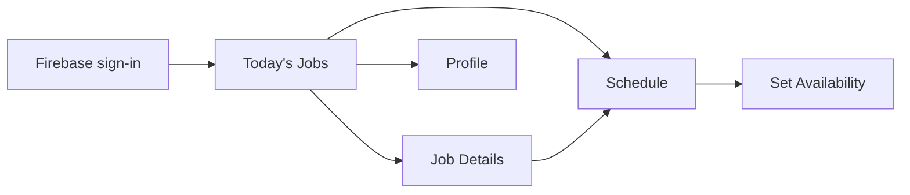

# Technician Android Screen and Behavior Specification

The Android app is a technician operational control surface. The backend decides legality, ownership, assignment, schedule truth, and lifecycle transitions. The app presents server state and submits commands.

## Navigation and access

After Firebase authentication and backend identity resolution, the technician enters the assigned-work surface. The minimum navigation model is:

The design guide mentions Messages and Parts in persistent navigation, but the supplied screen set and confirmed product requirements do not establish those as current capabilities. Do not implement them without an approved product decision.

## Screen contracts

| Screen | Reads | Commands | Required states |
|---|---|---|---|
| Today’s Jobs | Technician-scoped, automatically accepted jobs for date, status, effective times, freshness | Report unable to serve with mandatory reason; open job | Loading, empty, stale/offline, conflict, unauthorized |
| Job Details | Job, customer phone/address, service, timeline, assignment, current schedule | En route, record arrival, start diagnosis, transfer to workshop, complete, report inability, call customer, open Google Maps directions | Legal-action filtering from server state; confirmation for irreversible actions; retry/conflict |
| Schedule | Technician-scoped committed entries and revisions | Request adjustment preview; commit authorized adjustment; refresh | Earlier/later reflow preview, affected jobs, conflict, stale version |
| Availability | Effective system-managed working-time, breaks, and capacity | Refresh/view details only | Loading, stale/offline, unavailable explanation |
| Profile | Application user, technician profile, capabilities, session | Sign out; supported profile/session actions | Loading, signed out, expired session |

## Lifecycle and schedule behavior

The app must represent the server lifecycle: **Scheduled → En route → Arrived → Diagnosing → optional Device transferred → Workshop repair → Completed**, plus **Unable to serve**, **On hold**, and **Cancelled** when returned by the service workflow. Not every service uses every state. This separates travel, on-site arrival, and work start—an established field-service pattern—and keeps arrival as the backend event that establishes the customer cancellation-charge boundary. The app may request arrival but cannot set the charge flag. See [Microsoft Field Service lifecycle](https://learn.microsoft.com/en-us/dynamics365/field-service/work-order-status-booking-status) and [SAP service-order status flow](https://help.sap.com/docs/r/a764d2abcc004d9097942a48b3d83222/4.0/en-US/3ed80e8699bd4a03a16bea9d2553aa3c.html).

Early completion and delay are schedule mutations, not local drag-and-drop facts. The app requests a preview, shows affected bookings and customer-impact information returned by the server, then commits with an expected schedule version. The server persists revisions and emits notification work.

After an early completion, the system may allocate a subsequent job only when the technician's remaining working time can accommodate it and the server's capability, travel, and conflict rules succeed. After a delay, the server reflows affected work. In both cases the app renders the committed result; it does not choose the next job or calculate a revised route.

### Action visibility and confirmation

| Server job state / capability | Mobile action | Client responsibility | Server responsibility |
|---|---|---|---|
| Automatically assigned | Report unable to serve | Require a strong mandatory reason and explicit confirmation | Validate exceptional eligibility, preserve assignment audit, attempt eligible reassignment, or offer the nearest feasible slot if none is available |
| Scheduled and transition enabled | Start travel | Submit idempotent command | Validate ownership/state and record transition |
| En route and transition enabled | Record arrival | Ask for confirmation because arrival changes cancellation charging | Establish auditable arrival fact and cancellation boundary |
| Arrived and transition enabled | Start diagnosis | Submit command and refresh result | Validate applicable service workflow |
| Diagnosing and transfer enabled | Transfer to workshop | Confirm device-transfer outcome | Record lifecycle/audit data and schedule implications |
| A terminal transition enabled | Complete | Show required outcome fields returned by the contract | Validate completion and trigger downstream work |

The application must not use a locally inferred state to make a destructive action available. The job read model should provide current state, permitted actions, version, and required input metadata; the UI renders that contract.

### Availability distinction

The supplied availability layout is retained as a **read-only operational view**. It must distinguish:

- recurring weekly availability rules;
- a date-specific exception;
- a break within otherwise available time; and
- a full-day block.

The backend calculates effective availability from working-time rules, breaks, current assignments, capability, travel, and operational constraints. Technicians do not modify recurring availability, date exceptions, breaks, or full-day blocks in this release. The client presents the result and an explanation where practical.

## Error and freshness rules

- A `401` ends or refreshes the session through the identity boundary.
- A `403` is presented as insufficient scope; the app must not retry by changing IDs.
- A stale version/conflict response refreshes affected data and preserves the user’s unsent intent where safe.
- Network loss permits cached read-only assigned jobs/schedule. Mutations enter a bounded retry state only when the command is idempotent and its preconditions remain valid.
- The app never calculates availability, resolves overlap, assigns a technician, or decides a cancellation charge.
