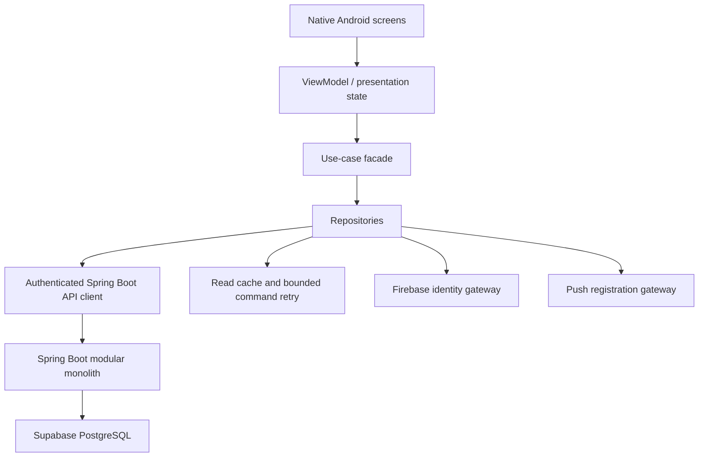

# Android Client Architecture

## Layers

The exact Android libraries are an implementation decision. The dependency direction is not: UI does not call Retrofit/HTTP directly, repositories do not contain scheduling policy, and no layer accesses PostgreSQL or Firebase business data directly.

## Ownership

| Layer | Owns | Must not own |
|---|---|---|
| UI | Rendering, accessibility, navigation, transient input | Domain truth or direct network calls |
| ViewModel | Screen state, loading/error mapping, lifecycle-safe command dispatch | Slot calculation, authorization, durable business state |
| Use-case facade | Technician actions and screen-oriented orchestration | Reimplementing server rules |
| Repository | API/cache coordination and DTO-to-domain mapping | Independent schedule or assignment decisions |
| API client | HTTP, auth headers, correlation/idempotency metadata | UI decisions or provider SDK leakage |
| Firebase gateways | Sign-in/token lifecycle and push registration | Jobs, bookings, schedules, customer records |

## Session and authorization

Firebase supplies technician identity. Spring Boot verifies the token and maps its external subject to an application user and technician. The client stores only the session material needed by the Firebase SDK and does not use Firebase UIDs as domain identifiers. Every technician query and command is server-scoped to the authenticated technician unless a future owner/admin permission explicitly grants broader scope.

## Local continuity

MVP local behavior is deliberately modest: cache the last successful assigned jobs, schedule, and job detail; show freshness; queue only safe, idempotent mutations; retry with backoff; and reconcile from the server after success or conflict. Do not build full offline scheduling, assignment, or multi-device synchronization.

## API boundary

Use business DTOs and commands corresponding to the existing backend API architecture. Expected families include technician jobs, job lifecycle commands, exceptional unable-to-serve reporting, technician schedule, schedule adjustment preview/commit, effective system-managed availability, and profile/session. Exact paths and payloads must be taken from the backend controllers/contracts at implementation time; the Android project must not infer them from Stitch HTML. The same Firebase authentication boundary already used by the customer web app is the selected identity approach for technicians.
