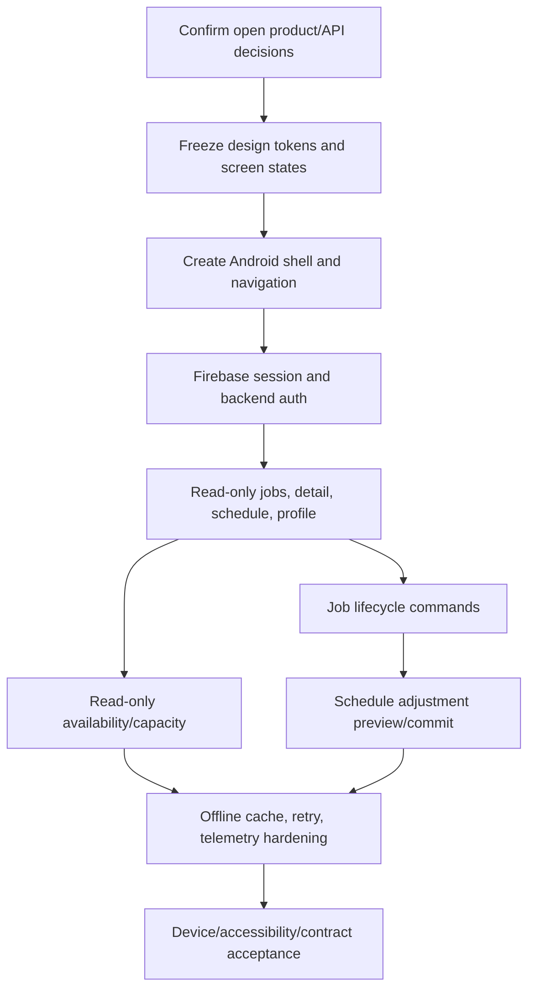

# Technician Android Implementation Handoff

## Dependency graph

## Work packages

1. Confirm backend endpoint names, response DTOs, legal job transitions, schedule preview/commit semantics, and the Android authentication configuration.
2. Establish native Android project conventions, design tokens, accessible components, navigation, session restoration, and global error handling.
3. Implement read models for Today’s Jobs, Job Details, Schedule, Availability, and Profile using assignment-scoped API queries.
4. Implement lifecycle commands and the exceptional unable-to-serve report with idempotency, expected-version handling, confirmation, and server response rendering. Do not implement accept/reject assignment or technician-managed availability commands.
5. Implement schedule adjustment preview/commit with explicit affected-booking review; never mutate local schedule as authority.
6. Add bounded cache/retry, push-as-refresh-hint, structured diagnostics, and accessibility/device validation.

Google Maps is the selected directions integration: Android opens the external Google Maps application for navigation. The mobile client does not implement in-app route tracking.

## Acceptance gates

- A technician cannot view or mutate another technician’s jobs by changing a client identifier.
- Every state-changing action is rejected or refreshed safely when the server reports stale state.
- Arrival is recorded only by the backend transition and is auditable.
- Early/delayed reflow displays affected jobs before commit and does not silently move customer commitments.
- Offline mode never invents availability, assignment, charge, or lifecycle truth.
- The five supplied screens retain their visual hierarchy, tokens, touch targets, and field-first interaction model.
- No Firebase datastore becomes a second source of booking, job, or schedule truth.
- The Android customer-facing assumptions do not override the already implemented customer web flow; that implementation remains the source of truth for customer authentication and booking behavior.

## Open decisions before implementation

- Exact Android framework/library set and minimum supported Android version.
- Push notification event coverage and Android permission/opt-in policy.

Resolve these against the existing architecture ADRs before creating production Android code. The design package alone cannot answer them.
